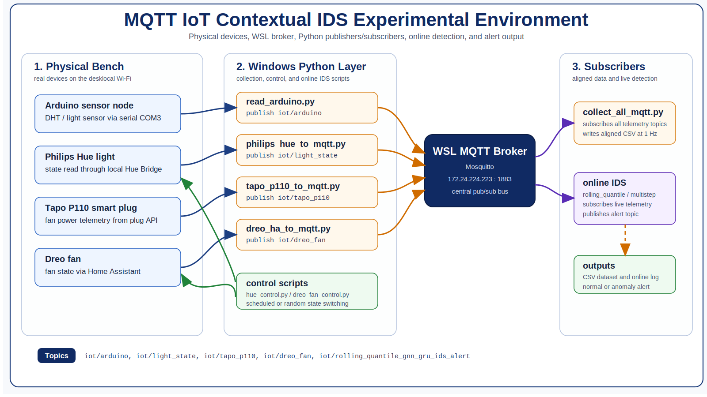
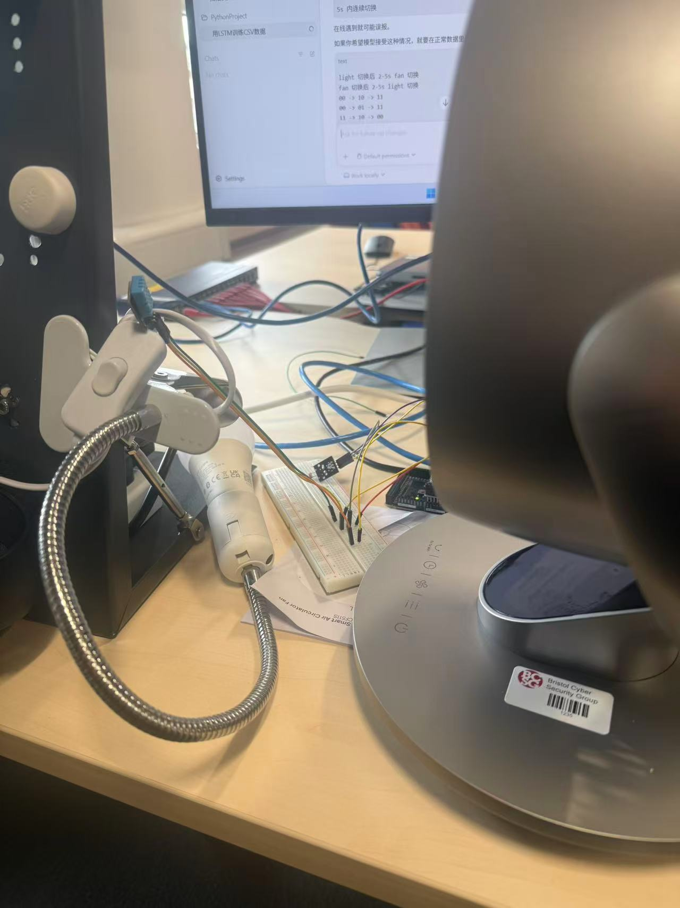

# Experimental Environment Architecture

This diagram summarizes the deployed IoT IDS testbed rather than the internal GAT-GRU training architecture.

## Physical Bench Photo

## Flow

1. Physical devices on the bench produce sensor, state, and power data.
2. Python publisher scripts read Arduino serial data, Philips Hue state, Tapo P110 power, and Dreo fan state.
3. The publishers send JSON telemetry to the Mosquitto MQTT broker running in WSL.
4. `collect_all_mqtt.py` subscribes to the telemetry topics and writes aligned 1 Hz CSV rows.
5. The online IDS subscribes to the same live topics, evaluates the rolling context, logs results, and publishes alerts.
6. Control scripts switch the Hue light and Dreo fan to create normal state transitions for collection and testing.

Key MQTT topics:

- `iot/arduino`
- `iot/light_state`
- `iot/tapo_p110`
- `iot/dreo_fan`
- `iot/rolling_quantile_gnn_gru_ids_alert`
