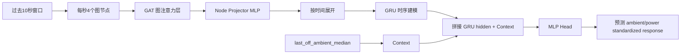
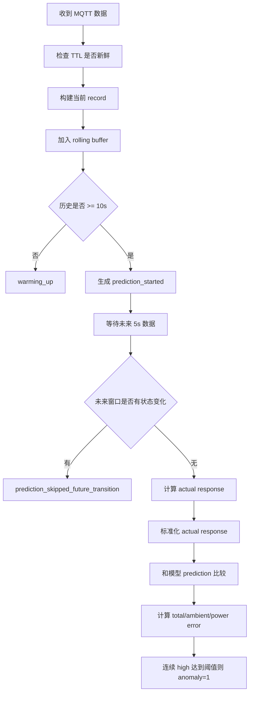

# 当前 Rolling Multi-step GAT-GRU Contextual IDS 总结

更新时间：2026-05-15  
对应代码：`train_rolling_multistep_gnn_gru_ids.py`，`online_rolling_multistep_gnn_gru_ids_mqtt.py`  
对应模型：`artifacts/rolling_multistep_gnn_gru_ids_run/rolling_multistep_gnn_gru_ids.pt`

## 1. 系统目标

当前 IDS 的目标是检测 IoT 设备的控制状态和物理反馈是否一致。

当前建模对象包括：

| 类型 | 变量 | 含义 |
|---|---|---|
| 控制状态 | `light_state` | Hue 灯开关状态，0=关，1=开 |
| 控制状态 | `fan_state` | 风扇开关状态，0=关，1=开 |
| 物理反馈 | `ambient_light` | Arduino 光照读数，当前传感器读数方向与真实亮度相反 |
| 物理反馈 | `total_power_w` | Tapo P110 总功率，包含灯和风扇功率 |

模型要学习的是：

```text
在过去 10 秒上下文下，未来 5 秒后半段的物理响应是否合理。
```

也就是说，模型不是单独判断某一个值是否异常，而是判断：

```text
light_state / fan_state 的状态变化
是否能解释 ambient_light / total_power_w 的未来响应。
```

## 2. 数据来源

当前训练数据来自：

```text
aligned_all_data_clean_delay.csv
```

主要字段：

| 字段 | 用途 |
|---|---|
| `time` | 时间戳 |
| `ambient_light` | 光照传感器读数 |
| `light_state` | 灯状态 |
| `fan_state` | 风扇状态 |
| `fan_power_w` / `total_power_w` / `power_w` | 总功率 |
| `arduino_age_seconds` | Arduino 数据年龄 |
| `light_age_seconds` | 灯状态数据年龄 |
| `tapo_age_seconds` | Tapo 功率数据年龄 |
| `dreo_age_seconds` | 风扇状态数据年龄 |
| `arduino_valid` / `light_valid` / `tapo_valid` / `dreo_valid` | 数据有效标记 |

当前模型不使用 `temperature` 和 `humidity`。

## 3. 数据清洗

训练脚本读取 CSV 后会执行以下处理：

1. 丢弃没有 `time` 的行。
2. 丢弃缺失 `light_state`、`fan_state`、`ambient_light`、`total_power_w` 的行。
3. 如果存在 valid 字段，则要求：

```text
arduino_valid = 1
light_valid = 1
tapo_valid = 1
dreo_valid = 1
```

4. `light_state` 和 `fan_state` 会四舍五入成 0/1。
5. 数据按 `time` 升序排列。
6. 如果相邻数据间隔超过 `max_gap_seconds=5`，切成新的 segment，避免把长时间断点连在一起训练。

## 4. 环境基线处理

为了让模型适应白天/晚上环境光不同，代码维护一个最近关灯环境基线：

```text
last_off_ambient_median
```

计算方法：

```text
维护最近 30 条 light_state=0 时的 ambient_light
取其中位数作为 last_off_ambient_median
```

特点：

| 作用 | 解释 |
|---|---|
| 适应环境光漂移 | 白天关灯和晚上关灯的 ambient_light 不一样 |
| 帮助预测开灯响应幅度 | 如果关灯基线很高，开灯后下降幅度通常更大 |
| 避免使用全局固定基线 | 不再用整个数据集的 off median |

注意：`last_off_ambient_median` 是一个全局 context 特征，不是每个节点的普通节点特征。

## 5. 滑动窗口样本构造

当前模型使用 rolling prediction 方式。

默认参数：

```text
input_window_seconds = 10
prediction_horizon_seconds = 5
```

每个训练样本由两部分组成：

```text
输入：过去 10 秒数据
输出：未来 5 秒后半段 median response
```

### 5.1 输入窗口

输入窗口包含过去 10 个时间步：

```text
[t-9, t-8, ..., t]
```

每个时间步包含 4 个节点：

```text
light_state
fan_state
ambient_light
total_power_w
```

### 5.2 预测窗口

预测窗口包含未来 5 秒：

```text
[t+1, t+2, t+3, t+4, t+5]
```

当前代码使用未来后半段：

```text
[t+3, t+4, t+5]
```

并取 median：

```text
future_tail_median = median(t+3, t+4, t+5)
```

这样做的目的：

```text
减少切换后前 1-2 秒延迟/抖动对 target 的影响。
```

### 5.3 跳过未来发生状态变化的样本

如果预测窗口内 `light_state` 或 `fan_state` 又发生变化，则跳过该样本。

原因：当前模型希望预测的是：

```text
当前状态保持不变时，未来物理反馈是否合理。
```

如果未来 5 秒内又发生新事件，target 会混入复合事件，不适合当前这版训练逻辑。

## 6. 训练目标

当前训练目标不是直接预测未来绝对值，而是预测 response：

```text
response = future_tail_median - current_value
```

对两个物理节点分别计算：

```text
ambient_response = future_tail_median_ambient - current_ambient
total_power_response = future_tail_median_power - current_power
```

例子：

```text
灯从关到开：
current ambient = 1000
future_tail_median ambient = 25
ambient_response = 25 - 1000 = -975
```

```text
风扇从关到开：
current power = 5.5W
future_tail_median power = 28W
power_response = 28 - 5.5 = 22.5W
```

## 7. Response 标准化

当前版本已经把输出 response 标准化。

训练集上拟合：

```text
response_scaler.mean
response_scaler.std
```

然后训练目标变成：

```text
standardized_response = (raw_response - response_mean) / response_std
```

当前模型中的 response scaler：

| 目标 | mean | std |
|---|---:|---:|
| `ambient_light` response | `1.095337` | `42.702965` |
| `total_power_w` response | `0.001520` | `2.688490` |

这样做的原因：

| 问题 | 标准化后的改善 |
|---|---|
| 光照 response 可达 ±900 以上 | 避免 raw MSE 被极端光照响应炸大 |
| 功率 response 只有几十瓦 | 让功率和光照在 loss 中尺度更接近 |
| train_loss 原来几百/上千 | 标准化后 loss 回到可解释范围 |

注意：训练、验证、在线检测的 error 和 threshold 都在标准化 response 空间计算。日志里的 `actual_delta_*` 和 `pred_delta_*` 会反标准化回原始单位，方便观察。

## 8. 图结构设计

当前图节点：

```text
light_state
fan_state
ambient_light
total_power_w
```

当前边：

```text
light_state -> ambient_light
light_state -> total_power_w
fan_state -> total_power_w
```

同时每个节点都有 self-loop。

图结构含义：

| 边 | 物理意义 |
|---|---|
| `light_state -> ambient_light` | 灯状态影响光照读数 |
| `light_state -> total_power_w` | 灯状态影响总功率 |
| `fan_state -> total_power_w` | 风扇状态影响总功率 |
| self-loop | 节点保留自身历史信息 |

当前没有加入：

```text
fan_state -> temperature
fan_state -> humidity
light_state -> temperature
```

因为当前这版模型暂时不使用温湿度。

## 9. 每个节点的输入特征

每个节点每个时间步有 4 个特征：

| 特征 | 含义 |
|---|---|
| standardized value | 当前值标准化后结果 |
| standardized delta | 当前值相对上一个时间步的标准化差分 |
| standardized age_seconds | 该数据源距当前聚合时间的年龄 |
| node_type | 控制节点为 1，物理节点为 0 |

其中控制节点：

```text
light_state
fan_state
```

物理节点：

```text
ambient_light
total_power_w
```

## 10. 模型结构

当前模型是：

```text
GAT + GRU + MLP Predictor
```

结构流程：



### 10.1 GAT 层

代码位置：`GraphAttentionLayer`

主要操作：

```text
node_feature_size = 4
graph_hidden_size = 16
```

每个节点先经过线性投影：

```text
4 -> 16
```

然后在预设边上计算 attention。

当前 attention 是模型学习得到的，不是固定权重。

### 10.2 Node Projector

GAT 输出后经过：

```text
ReLU
Linear(16 -> 16)
ReLU
```

作用是进一步变换每个节点的图表示。

### 10.3 GRU 时序层

GRU 输入是每个时间步所有节点表示拼接：

```text
4 nodes * 16 hidden = 64
```

GRU 默认参数：

```text
hidden_size = 64
gru_layers = 1
dropout = 0.3，仅多层 GRU 时作用于 GRU 内部
```

GRU 的作用：

```text
学习过去 10 秒内状态变化和物理量变化的时间关系。
```

例如：

```text
过去 10 秒里 light_state 刚从 0 变成 1
ambient_light 还没完全变化
模型应该预测未来 ambient_light 会继续下降
```

### 10.4 Context 拼接

GRU 最后一个 hidden state 会和 context 拼接：

```text
GRU hidden 64 + last_off_ambient_median context 1 = 65
```

这样模型在预测时可以知道当前环境光基线。

### 10.5 MLP Head

预测头结构：

```text
Linear(65 -> 64)
ReLU
Dropout(0.3)
Linear(64 -> 2)
```

输出 2 个值：

```text
standardized ambient_response
standardized total_power_response
```

## 11. Loss 计算

当前 loss 是 weighted MSE：

```text
per_target_error = (prediction - target)^2 * target_weight
sample_error = sum(per_target_error) / sum(target_weight)
```

默认权重：

```text
ambient_weight = 1.0
power_weight = 1.0
```

因为 target 已经是 standardized response，所以 loss 可以理解为：

```text
预测响应偏离真实响应多少个 response 标准差。
```

## 12. 训练集和验证集划分

当前按时间顺序划分：

```text
前 80% 数据作为训练集
后 20% 数据作为验证集
```

不是随机划分。

这样做的原因：

```text
在线检测是时间序列任务，验证集应该模拟未来数据。
```

当前训练结果摘要（本次训练控制台输出）：

| 指标 | 值 |
|---|---:|
| Raw rows | `85584` |
| Train samples | `63837` |
| Val samples | `15105` |
| Last shown epoch | `120` |
| Best shown val loss | `0.048235` |
| Final shown train loss | `0.018949` |
| Final shown val loss | `0.048235` |

本次训练 loss 记录：

| Epoch | Train loss | Val loss |
|---:|---:|---:|
| 001 | `0.545157` | `0.267821` |
| 010 | `0.129286` | `0.146610` |
| 020 | `0.031840` | `0.076036` |
| 030 | `0.025794` | `0.069617` |
| 040 | `0.021146` | `0.056466` |
| 050 | `0.020160` | `0.058447` |
| 060 | `0.021461` | `0.055750` |
| 070 | `0.020312` | `0.053049` |
| 080 | `0.019603` | `0.051419` |
| 090 | `0.019250` | `0.051131` |
| 100 | `0.020857` | `0.051120` |
| 110 | `0.019640` | `0.052380` |
| 120 | `0.018949` | `0.048235` |

当前 `metrics.json` 中保存的 artifact 指标：

| 指标 | 值 |
|---|---:|
| Saved best val loss | `0.046948` |
| Saved final train loss | `0.020276` |
| Saved final val loss | `0.046948` |

> 注：上面第一张表保留这次控制台打印出来的训练记录；`metrics.json` 中的保存指标来自当前 artifact 文件，可能对应最佳 checkpoint/完整训练记录，因此与最后一行控制台输出有轻微差异。

## 13. 阈值计算

阈值不是手动固定的，而是在验证集上统计得到。

默认：

```text
threshold_percentile = 97
```

总阈值：

```text
threshold = validation sample_error 的第 97 百分位
```

单目标阈值：

```text
ambient_threshold = validation ambient_error 的第 97 百分位
power_threshold = validation power_error 的第 97 百分位
```

当前阈值：

| 阈值 | 值 |
|---|---:|
| Total threshold | `0.051795` |
| Ambient target threshold | `0.005090` |
| Power target threshold | `0.083295` |

percentile 越高，阈值越高，越不容易报警。

```text
95 percentile：更敏感，误报可能增加
97 percentile：当前默认
98 percentile：更宽松，误报减少但漏报可能增加
99 percentile：更宽松
```

## 14. 在线检测流程

在线检测脚本订阅 MQTT：

```text
iot/arduino
iot/light_state
iot/tapo_p110
iot/dreo_fan
```

每秒构建当前记录：

```text
light_state
fan_state
ambient_light
total_power_w
age_seconds
last_off_ambient_median
```

在线流程：



## 15. 在线异常判定逻辑

在线计算：

```text
total_high_error = total_error > threshold
ambient_high_error = ambient_error > ambient_threshold
power_high_error = power_error > power_threshold
```

当前 high 判断：

```text
high_error = total_high_error OR ambient_high_error OR power_high_error
```

连续高误差：

```text
consecutive_high_error >= consecutive
```

默认：

```text
consecutive = 2
```

如果运行时使用：

```text
--no-latch
```

则异常会在 high streak 消失后恢复为 0。

如果不使用 `--no-latch`，一旦 anomaly=1，会保持 latched 状态。

## 16. 当前在线日志字段解释

| 字段 | 含义 |
|---|---|
| `error` | total standardized error |
| `threshold` | total error 阈值 |
| `err_ambient_light` | ambient standardized squared error |
| `err_total_power_w` | power standardized squared error |
| `th_ambient_light` | ambient 单项阈值 |
| `th_total_power_w` | power 单项阈值 |
| `actual_ambient_light` | 未来窗口实际 tail median ambient |
| `pred_ambient_light` | 预测的未来 tail ambient，已反标准化 |
| `actual_delta_ambient_light` | 实际 ambient response，原始单位 |
| `pred_delta_ambient_light` | 预测 ambient response，原始单位 |
| `actual_total_power_w` | 未来窗口实际 tail median power |
| `pred_total_power_w` | 预测未来 tail power，已反标准化 |
| `actual_delta_total_power_w` | 实际 power response，原始单位 |
| `pred_delta_total_power_w` | 预测 power response，原始单位 |
| `last_off_ambient_median` | 最近关灯环境光基线 |
| `seconds_since_last_transition` | 当前输入窗口中距离上次状态变化约多少秒 |
| `input_transition_count` | 输入 10 秒窗口内状态变化次数 |

## 17. 当前模型学到的关系

最新 attention summary：

当前这次 `metrics.json` 没有保存 `mean_attention`，因此这里不继续沿用旧训练的 attention 数值，避免把不同模型版本混在一起。

如果需要重新查看图注意力关系，可以在下一次训练时保留训练输出中的：

```text
[INFO] Mean validation attention
```

需要重点观察的边仍然是：

| 关系 | 物理意义 |
|---|---|
| `light_state -> ambient_light` | 灯状态是否解释光照响应 |
| `light_state -> total_power_w` | 灯状态是否解释功率变化 |
| `fan_state -> total_power_w` | 风扇状态是否解释功率变化 |

注意：attention 不是最终因果权重，只能作为模型在图消息传递时关注程度的参考。

## 18. 当前观察到的典型检测行为

### 18.1 正常稳态

例如：

```text
state=00
ambient_light 缓慢变化
power 约 5W
```

标准化后模型多数能正常处理，不再因为 1-2 个光照单位漂移频繁误报。

### 18.2 灯开关切换

例如：

```text
00 -> 10
10 -> 00
```

模型能学习大方向：

```text
灯开：ambient_light 下降，power 上升
灯关：ambient_light 上升，power 下降
```

但切换后的前 1-3 秒仍可能出现短暂 high，原因是实际响应延迟和预测幅度有偏差。

### 18.3 风扇状态和功率不一致

如果出现：

```text
fan_state=1
但 total_power_w 接近 5W
```

模型会强烈报警。

这通常表示：

```text
风扇状态显示开，但实际功率不像风扇开
```

可能是攻击，也可能是 Dreo/HA 状态延迟。

## 19. 当前局限

| 局限 | 影响 |
|---|---|
| 切换态和稳态共用阈值 | 切换前几秒容易误报 |
| `fan_state` 可能有延迟 | 风扇刚关/刚开时可能和 power 对不上 |
| 未来窗口有状态变化会跳过 | 暂不处理复合事件序列 |
| 没有温湿度 | 当前只能检测灯/风扇对光照和功率的一致性 |
| `last_off_ambient_median` 会随最近 30 条 off 样本变化 | 可适应环境，但异常长期存在时可能逐渐被吸收 |

## 20. 常用命令

训练：

```powershell
python train_rolling_multistep_gnn_gru_ids.py
```

使用更宽松阈值重新训练：

```powershell
python train_rolling_multistep_gnn_gru_ids.py --threshold-percentile 98
```

使用更敏感阈值重新训练：

```powershell
python train_rolling_multistep_gnn_gru_ids.py --threshold-percentile 95
```

在线检测：

```powershell
python online_rolling_multistep_gnn_gru_ids_mqtt.py --no-latch
```

临时覆盖 total threshold：

```powershell
python online_rolling_multistep_gnn_gru_ids_mqtt.py --no-latch --threshold 0.020
```

注意：`--threshold` 只覆盖 total threshold，不会覆盖 ambient/power 单项阈值。

## 21. 当前版本一句话总结

当前模型是一个基于 GAT-GRU 的 rolling contextual predictor。它用过去 10 秒的设备状态、物理反馈和环境基线，预测未来 5 秒后半段的光照和功率 response。IDS 根据预测 response 和实际 response 的标准化误差判断异常。它现在已经能较好处理稳态和明显的状态-功率不一致，但切换后的短暂过渡阶段仍需要通过 transition threshold 或 grace period 进一步优化。
