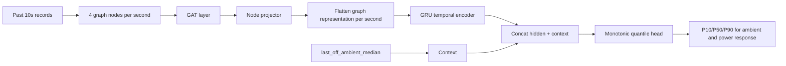

# Rolling Quantile GAT-GRU Contextual IDS Summary

更新时间：2026-05-15  
对应代码：`train_rolling_quantile_gnn_gru_ids.py`，`online_rolling_quantile_gnn_gru_ids_mqtt.py`  
对应模型输出目录：`artifacts/rolling_quantile_gnn_gru_ids_run`

## 1. 模型目标

这版模型的目标仍然是检测：

```text
设备控制状态和物理反馈是否一致
```

但它和单点预测版不同，不再只预测一个未来值，而是预测一个正常响应区间：

```text
P10 - P90
```

也就是说，模型回答的问题从：

```text
未来响应应该是多少？
```

变成：

```text
在当前上下文下，未来响应落在哪个范围内是正常的？
```

## 2. 使用变量

当前模型使用 4 个图节点：

| 节点 | 类型 | 含义 |
|---|---|---|
| `light_state` | 控制状态 | Hue 灯状态，0=关，1=开 |
| `fan_state` | 控制状态 | 风扇状态，0=关，1=开 |
| `ambient_light` | 物理反馈 | Arduino 光照读数 |
| `total_power_w` | 物理反馈 | Tapo P110 总功率，包含灯和风扇功率 |

当前不使用：

```text
temperature
humidity
```

## 3. 数据处理

数据来源：

```text
aligned_all_data_clean_delay.csv
```

清洗逻辑与单点预测版保持一致：

1. 丢弃缺失 `time` 的行。
2. 丢弃缺失 `light_state`、`fan_state`、`ambient_light`、`total_power_w` 的行。
3. 如果存在 valid 字段，则要求：

```text
arduino_valid = 1
light_valid = 1
tapo_valid = 1
dreo_valid = 1
```

4. `light_state` 和 `fan_state` 四舍五入成 0/1。
5. 按时间排序。
6. 相邻记录间隔超过 `max_gap_seconds=5` 时切成新 segment。

## 4. 输入窗口和预测窗口

默认设置：

```text
input_window_seconds = 10
prediction_horizon_seconds = 5
```

输入窗口：

```text
[t-9, t-8, ..., t]
```

预测窗口：

```text
[t+1, t+2, t+3, t+4, t+5]
```

当前 target 使用未来后半段：

```text
[t+3, t+4, t+5]
```

并取 median：

```text
future_tail_median = median(t+3, t+4, t+5)
```

这样可以减少刚切换后前 1-2 秒抖动对训练 target 的影响。

## 5. 未来状态切换处理

如果未来 5 秒预测窗口内 `light_state` 或 `fan_state` 发生变化，则跳过该样本。

原因是当前模型学习的是：

```text
当前状态保持不变时，未来物理响应是否合理
```

如果未来窗口又发生新的状态切换，target 会变成复合事件响应，当前版本暂时不把它作为训练样本。

## 6. Response Target

模型不直接预测未来绝对值，而是预测 response：

```text
response = future_tail_median - current_value
```

例如风扇从关到开：

```text
current power = 14.5W
future_tail_median power = 37.0W
power_response = 22.5W
```

例如灯从开到关：

```text
current ambient = 24
future_tail_median ambient = 179
ambient_response = 155
```

## 7. Response 标准化

训练前，代码会在训练集上统计每个 response 的均值和标准差：

```text
standardized_response = (raw_response - mean) / std
```

Quantile 模型也是在标准化 response 空间里训练。

这样做的原因：

| 问题 | 标准化作用 |
|---|---|
| `ambient_light` response 可能达到几百甚至更大 | 避免光照数值支配 loss |
| `total_power_w` response 通常只有几十瓦 | 让 power 和 ambient 训练尺度更接近 |
| 不同物理量单位不同 | 统一到标准化空间学习 |

在线日志中会把预测结果反标准化回原始单位，方便观察。

## 8. 图结构

图节点：

```text
light_state
fan_state
ambient_light
total_power_w
```

图边：

```text
light_state -> ambient_light
light_state -> total_power_w
fan_state -> total_power_w
```

同时每个节点有 self-loop。

物理含义：

| 边 | 含义 |
|---|---|
| `light_state -> ambient_light` | 灯状态影响光照传感器 |
| `light_state -> total_power_w` | 灯状态影响总功率 |
| `fan_state -> total_power_w` | 风扇状态影响总功率 |
| self-loop | 节点保留自身历史信息 |

## 9. 每个节点输入特征

每个节点每秒有 4 个特征：

| 特征 | 含义 |
|---|---|
| standardized value | 当前值标准化后结果 |
| standardized delta | 当前值相对上一秒的标准化差分 |
| standardized age_seconds | 数据源年龄 |
| node_type | 控制节点为 1，物理节点为 0 |

## 10. 环境光 Context

模型使用：

```text
last_off_ambient_median
```

计算方式：

```text
维护最近 30 条 light_state=0 时的 ambient_light
取中位数作为当前关灯环境光基线
```

作用：

```text
帮助模型区分白天/晚上或环境光变化。
```

这个值不是图节点，而是作为 GRU hidden 后的额外 context 输入到 MLP head。

## 11. 模型结构

整体结构：

```text
GAT -> Node Projector -> GRU -> Quantile Head
```

流程：



### 11.1 GAT Layer

节点输入：

```text
node_feature_size = 4
```

图隐藏维度：

```text
graph_hidden_size = 16
```

GAT 用预设边在节点之间传递消息，并学习 attention 权重。

### 11.2 GRU Layer

每个时间步的图节点表示会拼接成：

```text
4 nodes * 16 hidden = 64
```

GRU 参数：

```text
hidden_size = 64
gru_layers = 1
```

GRU 学习过去 10 秒内控制状态和物理反馈的时序变化关系。

### 11.3 Monotonic Quantile Head

Quantile head 输出每个目标的：

```text
P10
P50
P90
```

为了保证区间顺序正确，代码不是直接输出 P10/P50/P90，而是输出：

```text
center
lower_width_raw
upper_width_raw
```

然后构造：

```text
P50 = center
P10 = center - softplus(lower_width_raw)
P90 = center + softplus(upper_width_raw)
```

因为：

```text
softplus(x) > 0
```

所以模型结构天然保证：

```text
P10 <= P50 <= P90
```

## 12. Quantile Loss

训练使用 pinball quantile loss。

对某个分位数 `q`：

```text
if actual > prediction:
    loss = q * (actual - prediction)

if actual < prediction:
    loss = (1 - q) * (prediction - actual)
```

直观解释：

| 分位数 | 学到什么 |
|---|---|
| P10 | 正常响应的低边界 |
| P50 | 正常响应的中位数 |
| P90 | 正常响应的高边界 |

## 13. 在线检测逻辑

在线检测仍然每秒启动预测，等待未来 5 秒后评分。

如果实际 response 落在预测区间内：

```text
P10 <= actual_response <= P90
```

则：

```text
interval_error = 0
```

如果实际 response 超出区间：

```text
actual_response < P10
```

或：

```text
actual_response > P90
```

则只计算超出区间的距离：

```text
violation = max(P10 - actual, 0) + max(actual - P90, 0)
interval_error = violation^2
```

这意味着：

```text
区间内的正常波动不会被惩罚。
```

## 14. 阈值

虽然模型预测了 P10-P90 区间，但仍然需要阈值判断：

```text
total_error > total_threshold
ambient_error > ambient_threshold
power_error > power_threshold
```

这些阈值来自验证集 interval error 的 percentile。

如果使用：

```powershell
--threshold-percentile 99
```

则阈值表示：

```text
验证集 99% 正常样本的 interval error 不超过该值。
```

## 15. 日志字段

在线日志路径：

```text
artifacts/rolling_quantile_gnn_gru_ids_online_log.csv
```

关键字段：

| 字段 | 含义 |
|---|---|
| `actual_ambient_light` | 实际未来 tail median ambient |
| `pred_ambient_light_p10` | 预测 ambient 正常区间下边界 |
| `pred_ambient_light_p50` | 预测 ambient 中位数 |
| `pred_ambient_light_p90` | 预测 ambient 正常区间上边界 |
| `actual_total_power_w` | 实际未来 tail median power |
| `pred_total_power_w_p10` | 预测 power 正常区间下边界 |
| `pred_total_power_w_p50` | 预测 power 中位数 |
| `pred_total_power_w_p90` | 预测 power 正常区间上边界 |
| `err_ambient_light` | ambient interval error |
| `err_total_power_w` | power interval error |

## 16. 与单点预测版区别

| 对比项 | 单点预测版 | Quantile 版 |
|---|---|---|
| 输出 | 一个预测值 | P10/P50/P90 区间 |
| Loss | MSE | Quantile pinball loss |
| 正常波动处理 | 靠全局阈值容忍 | 靠模型预测区间容忍 |
| 切换附近表现 | 小偏差可能误报 | 可以学到更宽的切换区间 |
| 稳态表现 | 预测点附近严格 | 区间可自动变窄 |

## 17. 当前观察

在一次正常在线测试中，Quantile 版表现为：

```text
prediction_scored = 73
high_error = 0
anomaly = 0
```

状态切换包括：

```text
00 -> 10
10 -> 11
11 -> 01
01 -> 00
```

模型在切换附近表现出比较合理的动态区间：

```text
切换后早期区间较宽
进入稳态后区间收窄
```

例如风扇打开后：

```text
actual power ≈ 37.3W
predicted P10-P90 ≈ 33.4W - 41.1W
```

因此没有把正常的 1-2W 功率波动误报为异常。

## 18. 常用命令

训练：

```powershell
python train_rolling_quantile_gnn_gru_ids.py --threshold-percentile 99 --epochs 120
```

在线检测：

```powershell
python online_rolling_quantile_gnn_gru_ids_mqtt.py --no-latch
```

如果在 GitHub 仓库分层目录中运行：

```powershell
python models/rolling_quantile/train_rolling_quantile_gnn_gru_ids.py --csv-path data/aligned_all_data_clean_delay.csv --threshold-percentile 99 --epochs 120
```

```powershell
python models/rolling_quantile/online_rolling_quantile_gnn_gru_ids_mqtt.py --no-latch
```

## 19. 一句话总结

Quantile 版 GAT-GRU IDS 用过去 10 秒的上下文预测未来 5 秒后半段物理响应的正常区间。它不是判断实际值离某个单点预测有多远，而是判断实际响应是否落在模型根据当前上下文预测出的 P10-P90 正常范围内，因此更适合处理 IoT 物理反馈中的正常波动。

